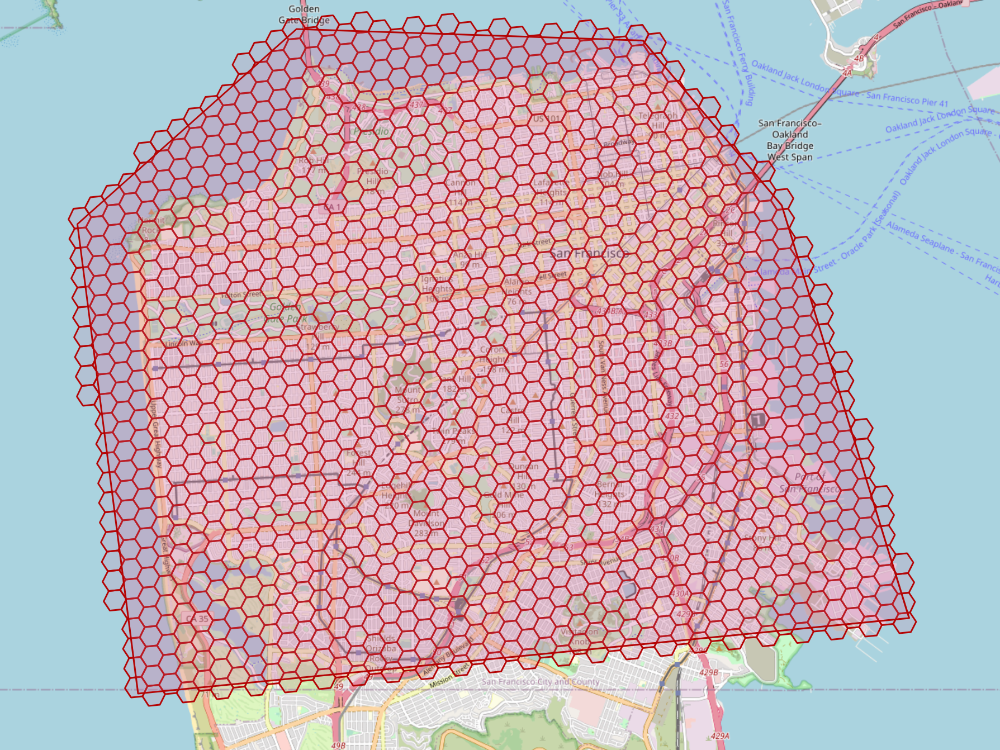
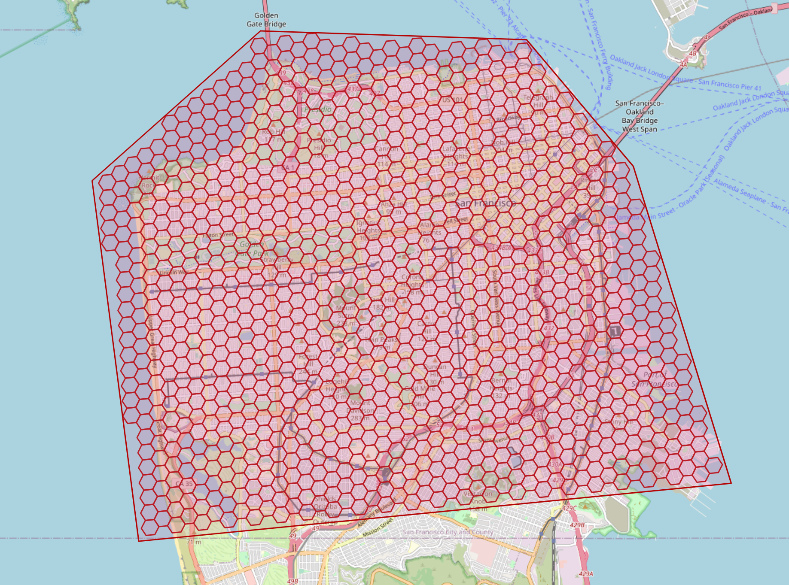

# Region Functions
Converts H3 indexes to and from polygonal areas.

## `Fill` (`polygonToCells`)
Fills a `Geometry` (`Polygon` or `LinearRing`) with the indexes who's centroids are contained within.  Returns `IEnumerable<H3Index>`.  Supports polygons with holes.

```cs
var reader = new WKTReader(geometryFactory);
var somePolygon = reader.Read("POLYGON ((-122.40898669969356 37.81331899988944, -122.47987669969707 37.81515719990604, -122.52471869969825 37.783587199903444, -122.51234369969448 37.70761319990403, -122.35447369969584 37.719806199904276, -122.38054369969613 37.78663019990699, -122.40898669969356 37.81331899988944))");
var filled = somePolygon.Fill(9).ToList();
```

`Fill` also accepts an optional second argument specifying the `VertextTestMode` to be used while checking containment during the fill operation:

  * `VertexTestMode.Center` (the default) requires that the center vertex of a given index must be within the provided polygon 

  * `VertexTestMode.Any` specifies that any vertex of a given cell's boundary may be within the provided polygon 

  * `VertexTestMode.All` specifies that all vertices of a given cell's boundary must be within the provided polygon 

#### `LineString`s / `TraceCoordinates`

There's also a `Fill` method which takes a NTS `LineString` instead of `Polygon`, and is the equivalent of calling `lineString.Coordinates.TraceCoordinates()`.  Tracing coordinatees works by drawing lines bewtween each vertex, estimating the number of cells between the vertices for the selected resolution, and then using NTS' `LinearLocation.PointAlongSegmentByFraction` to interpolate the indexes that make up that line.  This is similar to the `index.LineTo()` method, except that instead of generating the line in grid space coordinates,`TraceCoordinates` interpolates lines utilizing the spherical coordinates (center) of each index.

## `GetCellBoundaries` (`cellsToMultiPolygon`):
Returns a `MultiPolygon` containing all of the cell boundaries of the input set of indices.

```cs
var filled = somePolygon.Fill(7).ToList();
var multiPolygon = indexes.GetCellBoundaries();
```

This produces the second image shown above.
