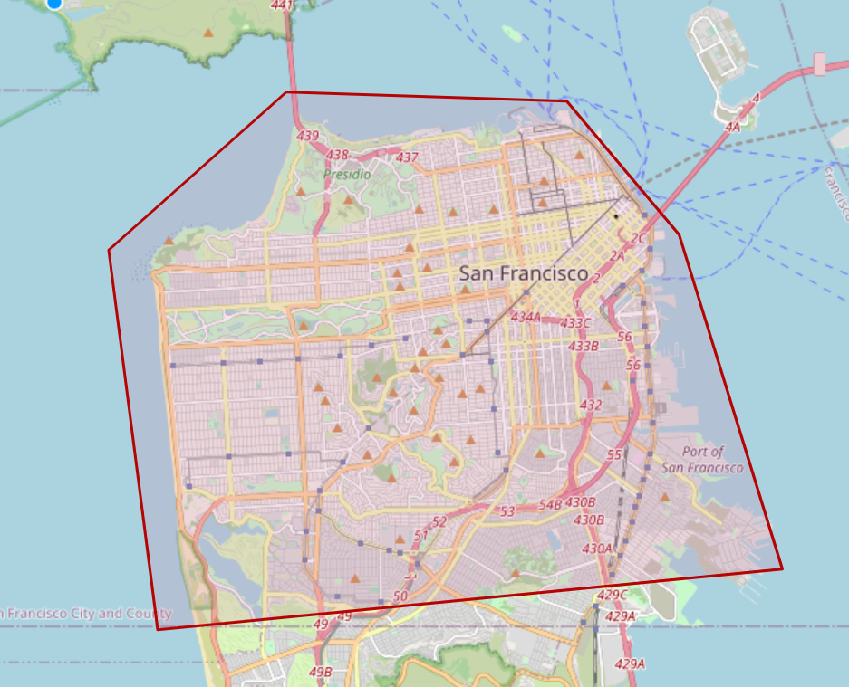
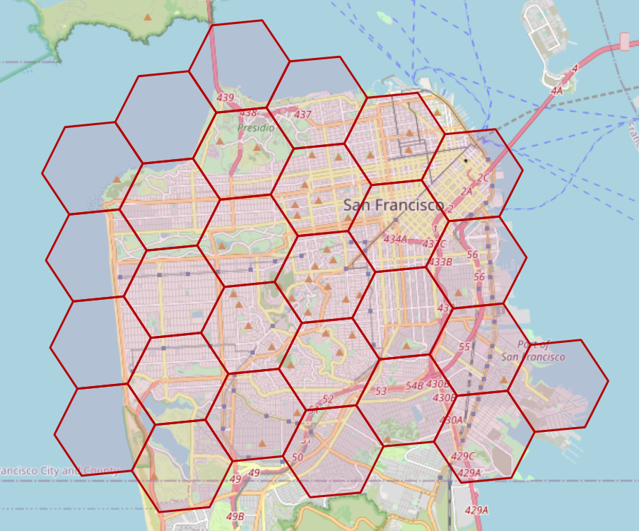

# Region Functions
Converts H3 indexes to and from polygonal areas.

## `Fill` (`polyfill`)
Fills a `Geometry` (`Polygon` or `LinearRing`) with the indexes who's centroids are contained within.  Returns `IEnumerable<H3Index>`.  Supports polygons with holes.

```cs
var reader = new WKTReader(geometryFactory);
var somePolygon = reader.Read("POLYGON ((-122.40898669969356 37.81331899988944, -122.47987669969707 37.81515719990604, -122.52471869969825 37.783587199903444, -122.51234369969448 37.70761319990403, -122.35447369969584 37.719806199904276, -122.38054369969613 37.78663019990699, -122.40898669969356 37.81331899988944))");
var filled = somePolygon.Fill(7).ToList();
```

### Sample Output

`Polygon` being filled:


Output `MultiPolygon` showing all indicies at resolution 7:


There's also an overload that takes a `LineString` and traces it, returning the indexes along the path.

## `GetCellBoundaries` (`h3SetToMultiPolygon`):
Returns a `MultiPolygon` containing all of the cell boundaries of the input set of indices.

```cs
var filled = somePolygon.Fill(7).ToList();
var multiPolygon = indexes.GetCellBoundaries();
```

This produces the second image shown above.
