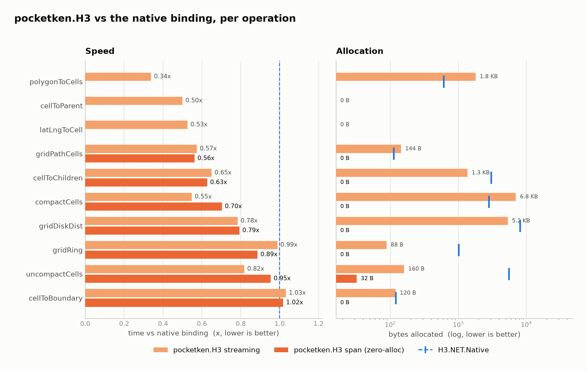
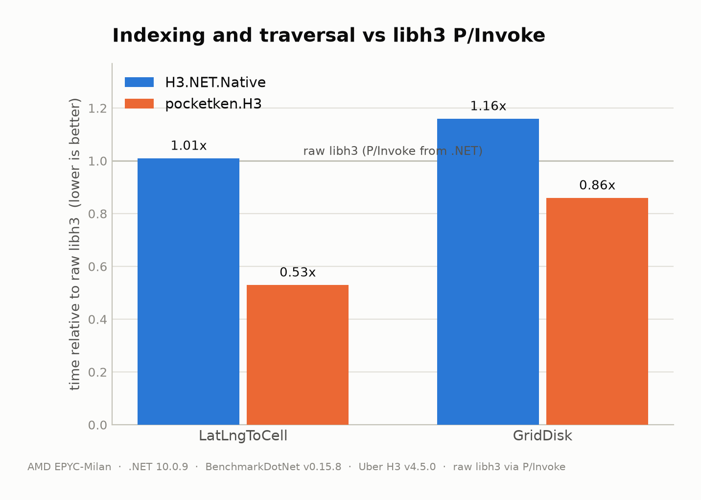
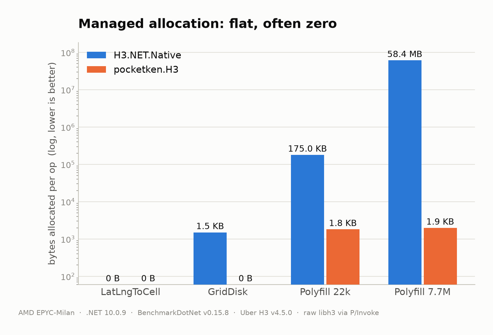
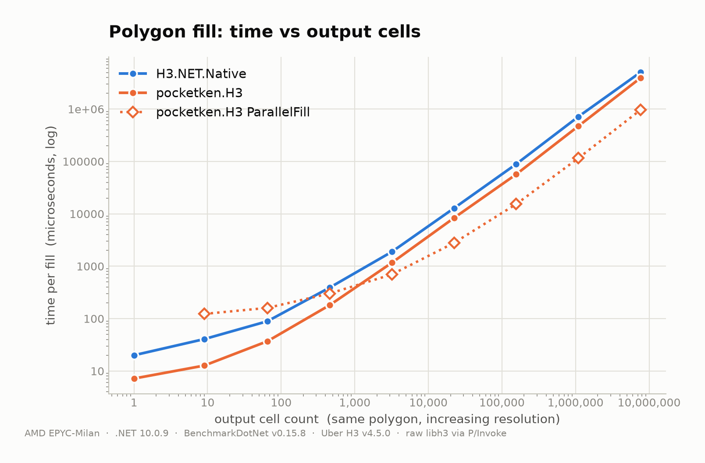

# pocketken.H3 vs a native binding

This compares the managed port against a native H3 binding ([H3.NET.Native](https://github.com/FOOincognita/H3.NET.Native), a `[LibraryImport]` wrapper over Uber's `libh3`) on identical inputs, in the same process. The point is not "managed beats C". It is to see what a .NET app actually gives up, or does not, by using the pure-managed port instead of paying to call the C library.

## Read this first

- One box, one afternoon: this one happens to be **AMD EPYC-Milan, Ubuntu 24.04.4, .NET 10.0.9, BenchmarkDotNet 0.15.8**; YMMV.
- `libh3` is **Uber H3 v4.5.0 built from source**, CMake `Release` (`-O3`, generic arch, no `-ffast-math`, no `-march=native`). A fast-math or native-arch build would move the native numbers.
- The **"raw libh3" baseline is a bare P/Invoke from .NET**, not native C. It is the floor for *calling* libh3 from a .NET process, which is the only way a .NET app gets at it. It is not libh3's compute floor. libh3 called from C, with no interop, would be faster, and nothing here measures that.
- **Ratios travel better than microseconds**, but they still move with OS, libc, libm, CPU, and JIT. Rerun on your own hardware before quoting anything.
- Where pocketken exposes both a streaming API (returns a collection, allocates) and a span API (fills a caller buffer, allocates nothing), both are shown, each against the binding's matching call.

## At a glance

Speed and allocation across the API surface, per operation, relative to the native binding.

At or below the binding on speed for every operation except `cellToBoundary` (where the binding returns a bare coordinate list and pocketken builds an NTS geometry), and the span API allocates nothing.

| Operation | pocketken streaming | pocketken span | H3.NET.Native |
| --- | ---: | ---: | ---: |
| `polygonToCells` | 62.6 µs (0.34x) | | 185.2 µs |
| `cellToParent` | 259.5 ns (0.50x) | | 519.5 ns |
| `latLngToCell` | 168.8 ns (0.53x) | | 320.7 ns |
| `compactCells` | 3.4 µs (0.55x) | 4.1 µs (0.70x) | 6.2 µs |
| `gridPathCells` | 1.3 µs (0.57x) | 1.3 µs (0.56x) | 2.3 µs |
| `cellToChildren` | 1.0 µs (0.65x) | 721 ns (0.63x) | 1.6 µs |
| `gridDiskDistances` | 5.4 µs (0.78x) | 5.0 µs (0.79x) | 6.9 µs |
| `uncompactCells` | 2.1 µs (0.82x) | 1.8 µs (0.95x) | 2.5 µs |
| `gridRingUnsafe` | 1.3 µs (0.99x) | 1.1 µs (0.89x) | 1.3 µs |
| `cellToBoundary` | 1.0 µs (1.03x) | 994 ns (1.02x) | 977 ns |

## Speed vs raw libh3

The smallest operations are dominated by fixed cost. A native call pays the managed to native transition every time; the managed port never leaves the runtime, so it comes in below even a bare P/Invoke to `libh3`.

| Operation | raw libh3 (P/Invoke) | H3.NET.Native | pocketken.H3 |
| --- | ---: | ---: | ---: |
| `latLngToCell` | 318.8 ns | 320.7 ns (1.01x) | **168.8 ns (0.53x)** |
| `gridDisk` (into buffer) | 1585.8 ns | 1834.4 ns (1.16x) | **1361.5 ns (0.86x)** |

pocketken runs below the floor for *calling* libh3 from .NET, because it skips the crossing that floor is made of. That is not the same as beating libh3 in C, which this does not measure.

## Allocation

Indexing and traversal into a caller buffer allocate **nothing**. The fill streams through pooled working buffers, so it stays flat regardless of output size: about **2 KB** whether it returns one cell or 7.66 million. The binding materializes an array the C side sizes from the bounding box, so its allocation grows with the output, to **58 MB** at 7.66 million cells.

| Operation | H3.NET.Native | pocketken.H3 |
| --- | ---: | ---: |
| `latLngToCell` | 0 B | 0 B |
| `gridDisk` (into buffer) | 1,504 B | **0 B** |
| `polygonToCells` (~22k cells) | 179,182 B | **1,816 B** |
| `polygonToCells` (7.66M cells) | 61,283,016 B | **1,984 B** |

The span overloads (`GridDiskDistances`, `GridPathCells`, `CompactCells`, `UncompactCells`, `GetChildrenForResolution`, `GetCellBoundaryVertices` and the rest) fill a caller buffer and allocate nothing; the streaming APIs allocate only the collection they return.

## polygonToCells

One fixed ~0.5° box around SF, filled at increasing resolution, so the output climbs from 1 cell to 7.66 million while the polygon stays put.

| Resolution | Output cells | H3.NET.Native | pocketken.H3 | ParallelFill |
| ---: | ---: | ---: | ---: | ---: |
| 4 | 1 | 20.0 µs | **7.2 µs** | |
| 6 | 65 | 89.2 µs | **37.0 µs** | 160 µs |
| 8 | 3,189 | 1.89 ms | **1.16 ms** | 0.70 ms |
| 10 | 156,334 | 89.2 ms | **56.9 ms** | 15.3 ms |
| 11 | 1,094,337 | 716.7 ms | **472.8 ms** | 115.7 ms |
| 12 | 7,660,354 | 5.05 s | **3.94 s** | **0.97 s** |

`pocketken.H3 Fill` is under the binding at every resolution. `ParallelFill` shards the box across cores: on this 4-core host it is worse than the sequential fill below a few thousand cells (res 6: 160 µs vs 37 µs, all overhead) and only starts paying off around res 8. At res 12 it fills the 7.66M-cell region in **0.97 s**, about 4x its own sequential fill and 5x the binding. It is opt-in for exactly those large fills.

## No native dependency

pocketken.H3 is a single managed assembly. There is no `libh3` to build, ship, load, version-match, or trust per platform. It targets `netstandard2.0`/`netstandard2.1`/`net8.0`/`net10.0`, has no unsafe code or runtime codegen, and runs anywhere .NET runs, including where loading an unmanaged image is restricted. A native binding, however thin, has to carry a compiled `libh3` for every RID it supports.

Because it is pure IL with no unsafe code or runtime code generation, it is **Unity (IL2CPP) and Native AOT friendly**. Unity consumes the `netstandard2.1` (or `netstandard2.0`) assembly via something like NuGetForUnity, with no `System.Text.Json` dependency chain to fight. The hot-path APIs publish clean under a Native AOT (ILC) compile, the same class of ahead-of-time compiler as IL2CPP, with no trim or dynamic-code (IL2xxx/IL3xxx) warnings attributed to the library. A native binding can run under AOT/IL2CPP as well, but only if its `libh3` is present and statically linked for that platform.

## Accuracy

It is a port, so the goal is that it returns the reference library's results. Index and cell outputs match upstream `libh3` exactly. Geometry (center lat/lng, boundary vertices, cell area, edge length) agrees to floating-point noise which is orders of magnitude finer than the grid itself resolves (the finest cell, at res 15, is sub-metre). Geometry is a tolerance rather than bit-exact only because the transcendental functions route through the platform's libm; the integer index math is identical everywhere. The suite validates against Uber's test vectors and upstream output, including a polyfill corpus that pins each shape (thin sliver, concave L, box-with-hole, antimeridian, disjoint multipolygon) to `libh3`'s exact cell set.

If you find a bug that affects accuracy or performance, PRs are welcome.

---

*Numbers are point-in-time and host-specific. The harness lives in `benchmarks/H3.NativeCompare`; regenerate the data, charts and tables with the scripts in `benchmarks/charts` (`build_data.py`, then `generate_charts.py` / `generate_tables.py`).*
